# MCP API 使用教程

## 创建MCP服务器

我们选择用nodejs来实现bitfactory-mcp这个MCP服务器。

使用MCP官方提供的命令行工具来创建MCP服务器：

    npx @modelcontextprotocol/create-server bitfactory-mcp

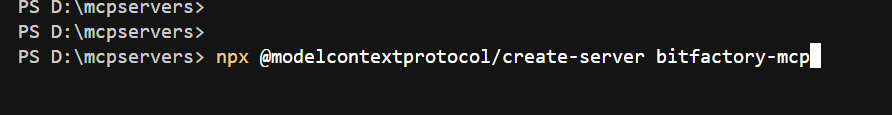

在终端执行上面命令，按照提示输入要创建的MCP服务器信息：

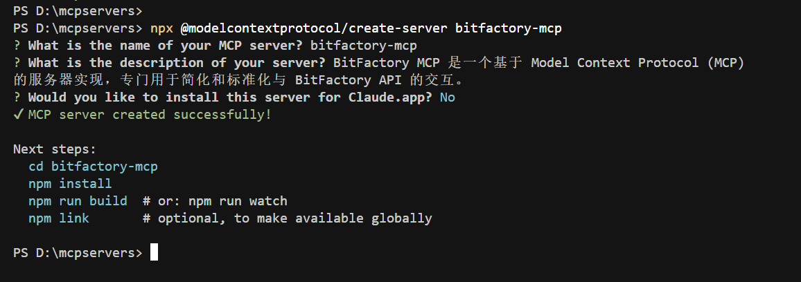

进入创建的MCP服务器目录，安装项目依赖：

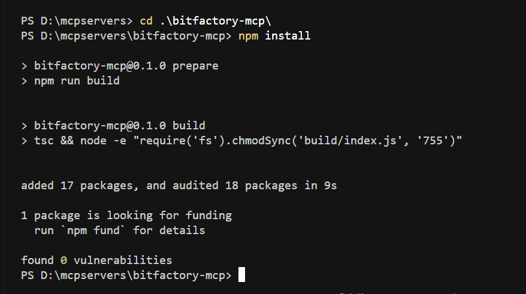

打开创建好的MCP服务器，可以看到默认生成的项目代码结构：

src/index.ts 是 MCP 服务器的源码文件，在此文件实现 MCP 服务器的业务功能，build/js 是 MCP 服务器源码编译后的可执行文件，调试阶段和发布上线，都要用到此文件。

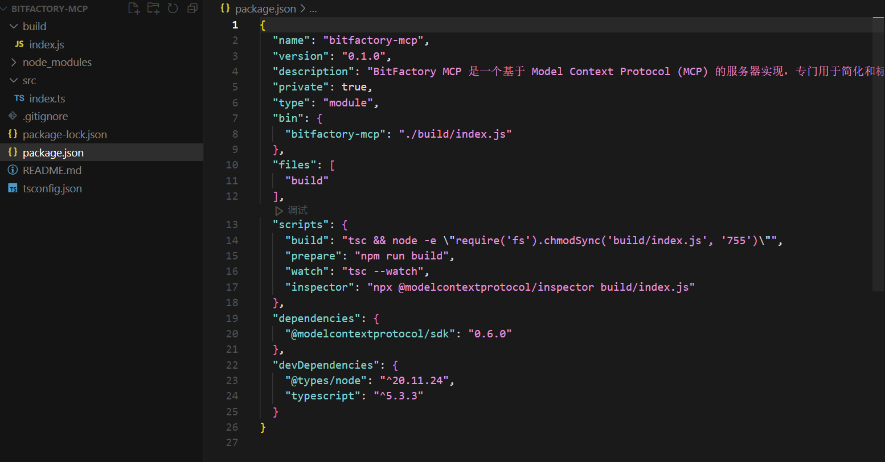

## 调试MCP服务器

在 MCP 服务器项目目录下，运行 npm run watch 启动一个监听服务，监听 src/index.ts 源码文件的内容变动，并实时编译成 build/index.js 可执行文件。

在 MCP 服务器项目目录下，运行 npm run inspector，实际执行的命令是：


此命令用到了 MCP 官方开发的一个调试工具，运行 MCP 服务器可执行文件，连接到 MCP 服务器进行功能调试。


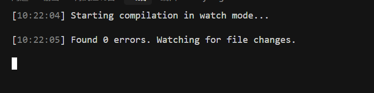
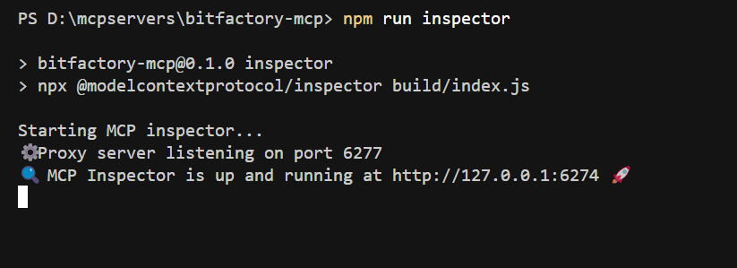

点击调试面板运行地址，进入 MCP 服务器调试面板。

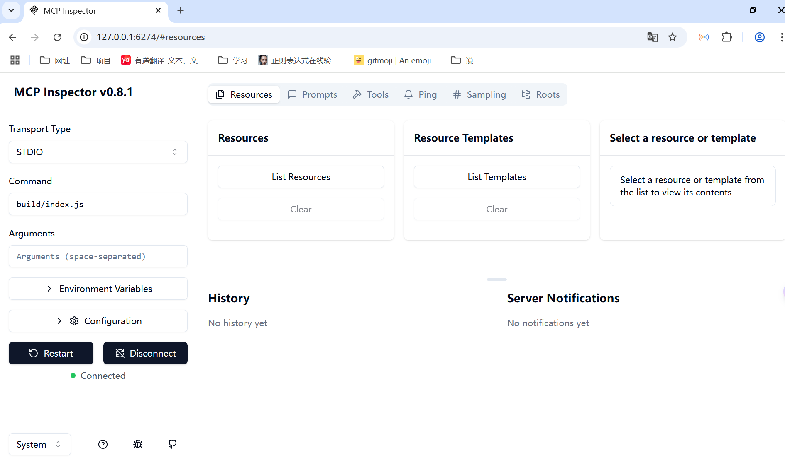

在 MCP 服务器调试面板，点左侧的 Connect 可以连接到 MCP 服务器进行调试，显示 Connected 表示连接成功。

可以设置 MCP 服务器启动参数 Arguments 和环境变量 Environment Variables，在 MCP 服务器实现逻辑中可以读取这两部分的参数值。

MCP 服务器调试面板右侧主要用于请求 MCP 服务器内部定义的资源（Resources）、提示词（Prompts）、工具（Tools）等内容。

我们可以在右侧的 Tools 栏目点 List Tools 获取 MCP 服务器内部实现的所有工具（Tools）。

## 实现MCP服务器业务逻辑

1.  定义MCP服务器信息

    在src/index.ts文件，通过new Server创建MCP服务器信息（实现tools能力）。

    ```typescript
    /**
     * Create an MCP server with capabilities for resources (to list/read notes),
     * tools (to create new notes), and prompts (to summarize notes).
     */
    const server = new Server(
      {
        name: "bitfactory-mcp",
        version: "0.0.1",
      },
      {
        capabilities: {
          // resources: {},
          tools: {},
          // prompts: {},
        },
      }
    );
    ```
2.  定义MCP服务器工具列表

    修改 src/index.ts 文件中默认生成的获取工具列表（ListTools）的逻辑，定义一个 getAccount 方法，写上功能描述，说明这个工具（Tool）的作用是获取链上某个账户的信息。

    getAccount 工具的参数依据星火链API文档来定义，其中apikey是必填项，api-secret根据用户定义来决定是否要填写，勾选就必须传，否则就不需要。

    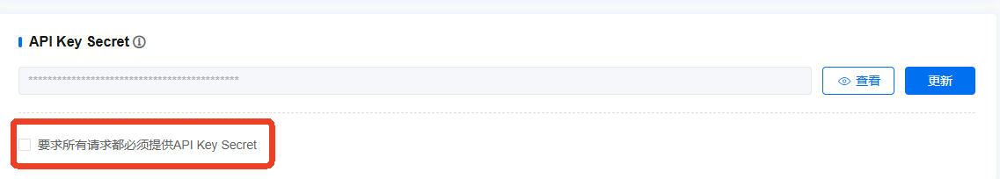

    星火链获取链上某个账户的信息API文档如下图：

    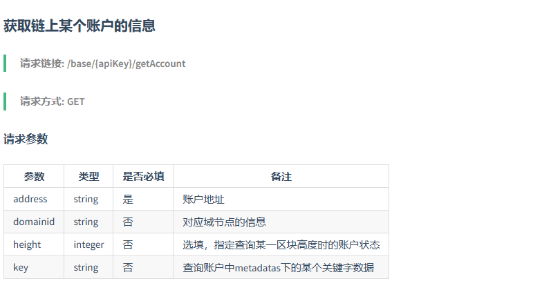

    ListTools 的定义如下：

    ```typescript
    server.setRequestHandler(ListToolsRequestSchema, async () => {
      return {
        tools: [
          {
            name: "getAccount",
            description: "获取链上某个账户的信息",
            inputSchema: {
              type: "object",
              properties: {
                apiKey: {
                  type: "string",
                  description: "API key for authentication"
                },
                apiSecret: {
                  type: "string",
                  description: "header apiSecret"
                },
                address: {
                  type: "string",
                  description: "账户地址"
                },
                domainid: {
                  type: "string",
                  description: "对应域节点的信息"
                },
                height: {
                  type: "number",
                  description: "选填，指定查询某一区块高度时的账户状态"
                },
                key: {
                  type: "string",
                  description: "查询账户中metadatas下的某个关键字数据"
                }
                
              },
              required: ["apiKey", "apiSecret", "address", "domainid", "height", "key"]
            }
          }
    ]
      };
    });
    ```
3.  实现MCP服务器工具（Tool）逻辑

    我们先创建一个新的文件，src/client.ts，定义一个BitFactoryClient类，实现sendGet和getAccount方法，其中sendGet方法是查询类（GET请求）API的通用方法，getAccount方法是获取链上某个账户信息的方法。

    ```typescript
    /**
    * Query client for BitOps API interaction
    */
    export class BitFactoryClient{
        
    private readonly apiUrl: string;

    /**
       * Create a new Query client
       * @param apiUrl - The API URL
       */
    constructor({ apiUrl }: { apiUrl: string }) {
        this.apiUrl = apiUrl;
      }
    /**
       * Send a query request
       * @param apiSecret - The API secret (optional)
       * @returns The response from the API
       */
    async sendGet({ apiSecret, path, params }: { apiSecret?: string, path?: string, params?: Record<string, string | number | boolean> } = {}): Promise<string> {
        try {
          const headers: Record<string, string> = {
            'accept': '*/*'
          };
          if (apiSecret) {
            headers['api-secret'] = apiSecret.trim();
          }
          
          let url = this.apiUrl;
          if (path) {
            url += `/${path}`;
          }
          if (params) {
            const queryParams = new URLSearchParams();
            Object.entries(params).forEach(([key, value]) => {
              if (value !== undefined) {
                queryParams.append(key, String(value));
              }
            });
            const queryString = queryParams.toString();
            if (queryString) {
              url += `?${queryString}`;
            }
          }
          const response = await fetch(url, {
            method: "GET",
            headers
          });
        
          const responseText = await response.text();
          
          if (!response.ok) {
            throw new Error(`Request failed with status ${response.status}: ${response.statusText}\nResponse: ${responseText}`);
          }
          return responseText;
          
        } catch (error: unknown) {
          if (error instanceof Error) {
            throw new Error(`Query request failed: ${error.message}`);
          }
          throw new Error('Query request failed: Unknown error');
        }
      }
      
    /**
     * Get account information
     * @param apiSecret - The API secret
     * @param address - The account address
     * @param domainid - The domain ID
     * @param height - The block height
     * @param key - The key to query
     * @returns The account information
     */
    async getAccount({apiSecret, address, domainid, height, key }: 
      { apiSecret: string, address: string, domainid?: string, height?: number, key?: string }): Promise<string> {
        try {
          if (!address) {
            throw new Error("Account address is required");
          }
          const params: Record<string, string | number> = {
            address
          };
          
          if (domainid !== undefined) {
            params.domainid = domainid;
          }
          if (height !== undefined) {
            params.height = height;
          }
          if (key !== undefined) {
            params.key = key;
          }
          const responseText = await this.sendGet({
            apiSecret: apiSecret, 
            path: 'getAccount',
            params
          });
          return responseText;
          
        } catch (error: unknown) {
          if (error instanceof Error) {
            throw new Error(`Get chain account failed: ${error.message}`);
          }
          throw new Error('Get chain account failed: Unknown error');
        }
     }
    ```


    然后，修改CallTool的逻辑，接到getAccount请求时，先获取参数，校验必填参数后，再调用QueryClient的getAccount方法。

    ```typescript
    /**
     * Handler for the create_note tool.
     * Creates a new note with the provided title and content, and returns success message.
     */
    server.setRequestHandler(CallToolRequestSchema, async (request) => {
      switch (request.params.name) {
        case "getAccount": {
          const args = request.params.arguments;
          if (!args || typeof args !== 'object') {
            throw new Error("Invalid arguments provided");
          }
          
          const apiKey = String(args.apiKey || "").trim();
          const apiSecret = String(args.apiSecret || "").trim();
          const address = String(args.address || "").trim();
          const domainid = args.domainid !== undefined ? String(args.domainid) : undefined;
          const height = args.height !== undefined ? Number(args.height) : undefined;
          const key = args.key !== undefined ? String(args.key) : undefined;
          if (!apiKey) {
            throw new Error("apiKey is required");
          }
          if (!address) {
            throw new Error("address is required");
          }
          
          const baseUrl = `https://bif-testnet.bitfactory.cn/base/${apiKey}`;
          const bitFactoryClient = new BitFactoryClient({ apiUrl: baseUrl });
          
          try {
            const result = await bitFactoryClient.getAccount({apiSecret, address, domainid, height, key });
            const jsonResult = JSON.parse(result);
            return {
              content: [{
                type: "text",
                text: JSON.stringify(jsonResult, null, 2)
              }]
            };
          } catch (error: unknown) {
            if (error instanceof Error) {
              throw new Error(`Get chain account failed: ${error.message}`);
            }
            throw new Error('Get chain account failed: Unknown error');
          }
    }
        default:
          throw new Error("Unknown tool");
      }
    });
    ```
4.  调试MCP服务器工具（Tool）

    在调试工具选择 getAccount工具，填入参数，点击 Run Tool，查看工具的调用结果：

    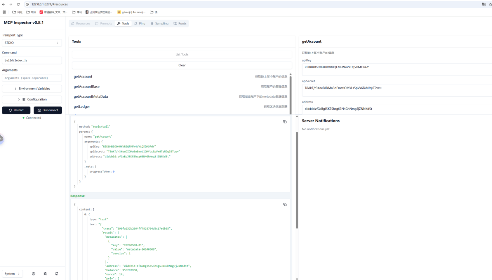

## 在MCP客户端测试

使用Cursor编辑器，作为 MCP 客户端。来测试我们开发的 bitfactory-mcp 服务器。

首先，打开 Cursor 的 MCP 服务器配置文件。

```typescript
{
  "mcpServers": {
    "bitfactory-mcp":{
      "command":"D:\\software\\node\\node.exe",
      "args":["D:\\IdeaProjects\\bitfactory-mcp\\build\\index.js"]
    }
  }
}
```

写入连接 bitfactory-mcp 的配置：

args 里面填写 bitfactory-mcp 服务编译后文件的绝对地址。

在 Cursor 的 MCP 配置面板，可以看到bitfactory-mcp 服务已经成功运行，并且获取到了可用的 Tools。

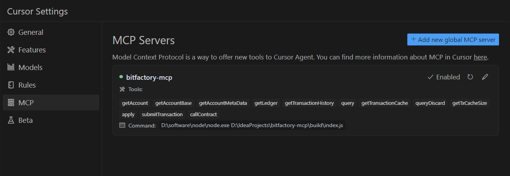

打开 Cursor AI 对话面板，选择 Agent 模式，输入以下或类似内容：

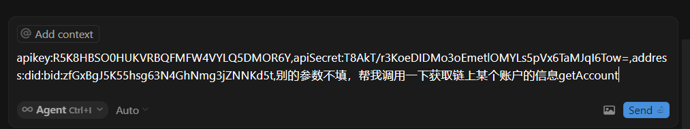

Cursor 会加载所有已配置的可用的 Tools 进行意图识别，识别到用户的意图是要记笔记，会自动调用 bitfactory-mcp 服务的 getAccount 工具。

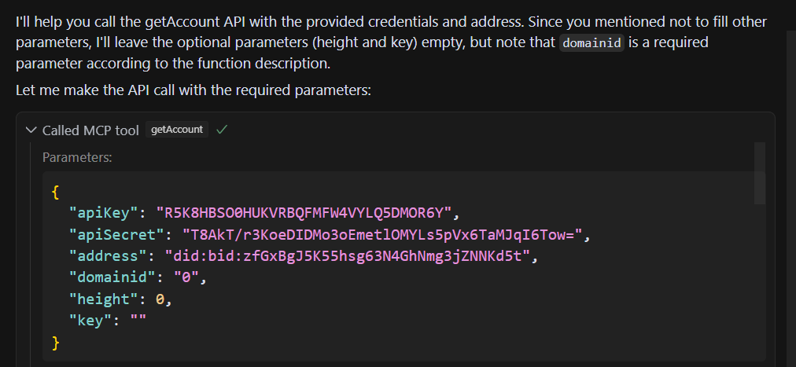

调用结果如下：

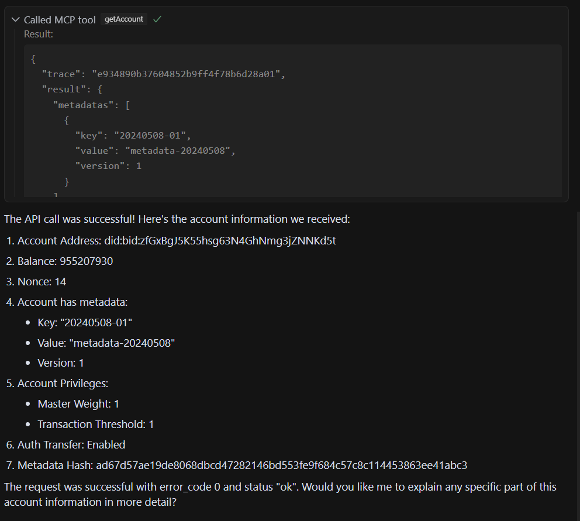
